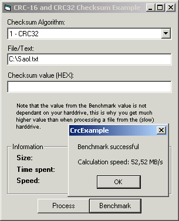



## Calculate Checksum \(CRC32 and CRC16\)

### Description

Yesterday, I was lookin' for some code to compute a CRC32 checksum value but could not find any fast working code here. So I made this class file that allows you to calculate real CRC32 checksums. I also needed *FAST* code so this uses assembler code that you can use without actually knowing any assembler. This code is able to compute 56 MB/s on a P3 600Mhz!!
 
### More Info
 

             |
---                |---
**Submitted On**   |2000-11-08 15:44:14
**By**             |[Fredrik Qvarfort](https://github.com/Planet-Source-Code/PSCIndex/blob/master/ByAuthor/fredrik-qvarfort.md)
**Level**          |Intermediate
**User Rating**    |5.0 (244 globes from 49 users)
**Compatibility**  |VB 5\.0, VB 6\.0
**Category**       |[Miscellaneous](https://github.com/Planet-Source-Code/PSCIndex/blob/master/ByCategory/miscellaneous__1-1.md)
**World**          |[Visual Basic](https://github.com/Planet-Source-Code/PSCIndex/blob/master/ByWorld/visual-basic.md)
**Archive File**   |[CODE\_UPLOAD114741182000\.zip](https://github.com/Planet-Source-Code/fredrik-qvarfort-calculate-checksum-crc32-and-crc16__1-12638/archive/master.zip)

